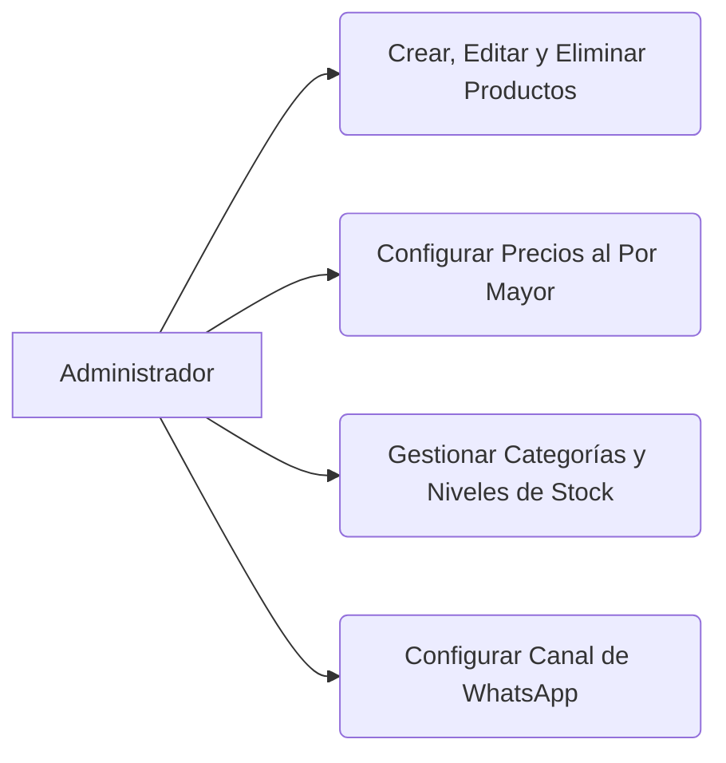

<!-- [SECTION_START: acceptance] -->

**Dado** que soy el Administrador
**Cuando** accedo al panel de administración
**Entonces** puedo gestionar el catálogo maestro para mantener la oferta comercial.

<!-- [SECTION_END: acceptance] -->

<!-- [SECTION_START: description] -->

Como Administrador, Quiero gestionar el inventario, los precios y las categorías de los productos. Para mantener una oferta comercial precisa y atractiva para los compradores.

**Módulo 6: Admin. del Catálogo y Precios**

<!-- [SECTION_END: description] -->
