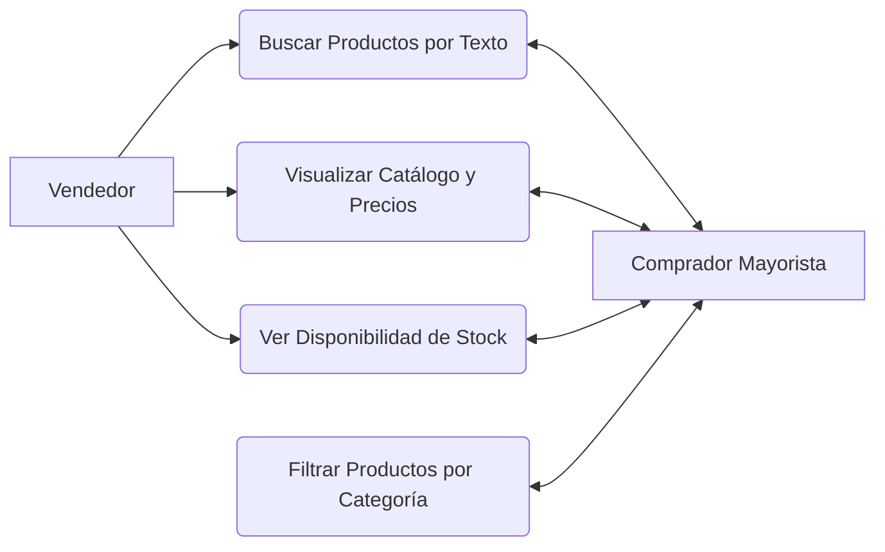

<!-- [SECTION_START: acceptance] -->

**Dado** que soy un Comprador Mayorista
**Cuando** busco insumos
**Entonces** encuentro rápidamente lo que deseo adquirir a través del catálogo.

<!-- [SECTION_END: acceptance] -->

<!-- [SECTION_START: description] -->

Como Comprador Mayorista, Quiero explorar, filtrar y buscar productos específicos dentro de la plataforma. Para encontrar rápidamente los insumos que deseo adquirir.

**Módulo 2: Catálogo Digital y Búsqueda**

<!-- [SECTION_END: description] -->
