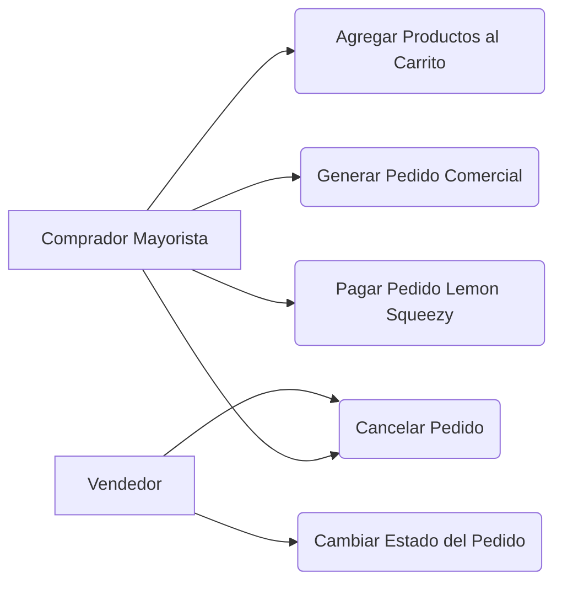

<!-- [SECTION_START: acceptance] -->

**Dado** que soy un Comprador Mayorista
**Cuando** finalizo mis selecciones
**Entonces** puedo consolidarlas en un carrito y concretar el pago de manera autónoma.

<!-- [SECTION_END: acceptance] -->

<!-- [SECTION_START: description] -->

Como Comprador Mayorista, Quiero consolidar mis selecciones en un carrito y concretar el pago. Para formalizar mi orden de compra de manera autónoma.

**Módulo 3: Gestión de Pedidos y Pagos**

<!-- [SECTION_END: description] -->
