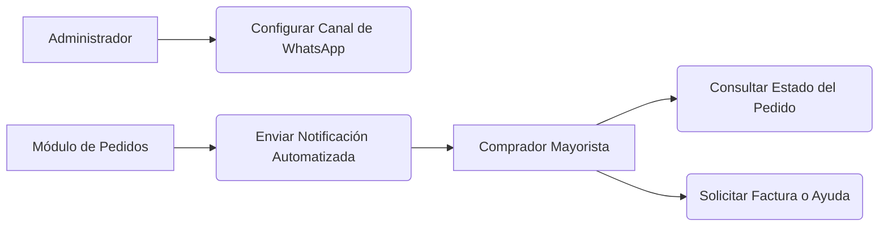

<!-- [SECTION_START: acceptance] -->

**Dado** que soy el Administrador
**Cuando** un pedido cambia de estado
**Entonces** el sistema comunica automáticamente el estado a través del canal de autoservicio.

<!-- [SECTION_END: acceptance] -->

<!-- [SECTION_START: description] -->

Como Administrador, Quiero que el sistema comunique automáticamente los estados de las órdenes. Para reducir la carga operativa de atención al cliente.

**Módulo 1: Notificaciones (WhatsApp)**

<!-- [SECTION_END: description] -->
