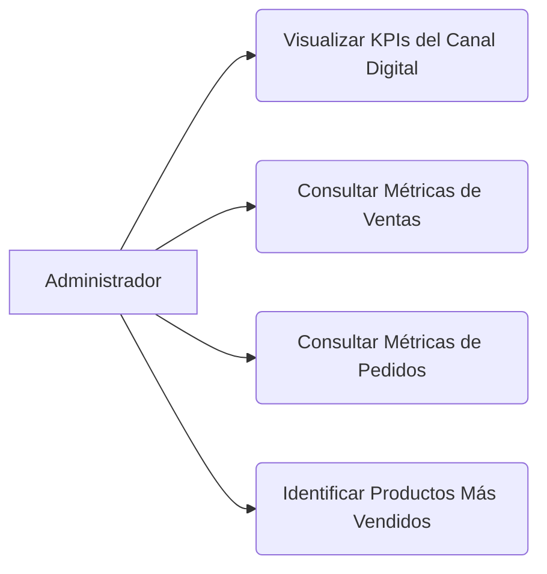

<!-- [SECTION_START: acceptance] -->

**Dado** que soy el Administrador
**Cuando** reviso el dashboard
**Entonces** veo la información de ventas y productos populares para evaluar el rendimiento.

<!-- [SECTION_END: acceptance] -->

<!-- [SECTION_START: description] -->

Como Administrador, Quiero consultar información consolidada de ventas y productos más populares. Para evaluar el rendimiento comercial y planificar el abastecimiento.

**Módulo 4: Dashboard Analítico**

<!-- [SECTION_END: description] -->
