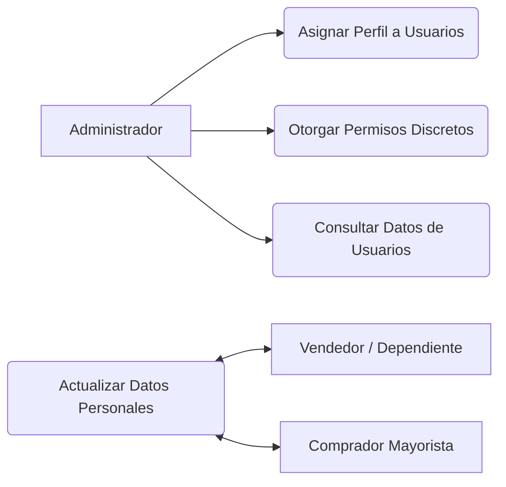

<!-- [SECTION_START: acceptance] -->

**Dado** que soy el Administrador
**Cuando** accedo a la gestión de usuarios
**Entonces** puedo configurar los roles y permisos para asegurar el acceso correcto a la información.

<!-- [SECTION_END: acceptance] -->

<!-- [SECTION_START: description] -->

Como Administrador, Quiero gestionar los roles y privilegios de los usuarios. Para asegurar que cada persona acceda únicamente a la información que le corresponde.

**Módulo 5: Control de Perfiles y Accesos**

<!-- [SECTION_END: description] -->
