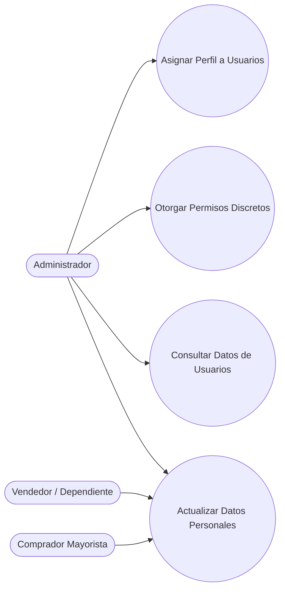

## Descripción del Módulo
<!-- [SECTION_START: Descripción del Módulo] -->
Actúa como el cimiento de seguridad e identidad de la plataforma, garantizando que cada actor interactúe únicamente con las funcionalidades que le corresponden. Separa la autogestión de la administración centralizada: los Vendedores y Compradores Mayoristas mantienen actualizada su información personal (nombres, género, fecha de nacimiento), mientras el Administrador ejerce el control total sobre la gobernanza de la plataforma (asigna perfiles y 14 permisos discretos). Incluye aplicación automatizada de reglas de integridad de datos y validación estricta de roles.
<!-- [SECTION_END: Descripción del Módulo] -->

## Diagrama (Mermaid)
<!-- [SECTION_START: Diagrama (Mermaid)] -->

<!-- [SECTION_END: Diagrama (Mermaid)] -->
