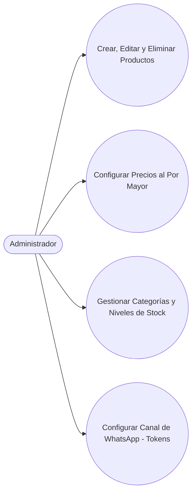

## Descripción del Módulo
<!-- [SECTION_START: Descripción del Módulo] -->
Actúa como el motor operativo y de control central del canal de mayoristas. Concentra sus operaciones en un único actor con privilegios elevados: el Administrador. Él es el encargado exclusivo de estructurar el inventario digital mediante el alta, edición y baja de productos, así como de organizar la jerarquía mediante categorías. Fija estratégicamente los precios al por mayor y controla manualmente la disponibilidad de stock y credenciales de comunicación. Actúa como un escudo automatizado que verifica criptográficamente el permiso ROLES_MANAGE antes de mutar la base de datos maestra.
<!-- [SECTION_END: Descripción del Módulo] -->

## Diagrama (Mermaid)
<!-- [SECTION_START: Diagrama (Mermaid)] -->

<!-- [SECTION_END: Diagrama (Mermaid)] -->
