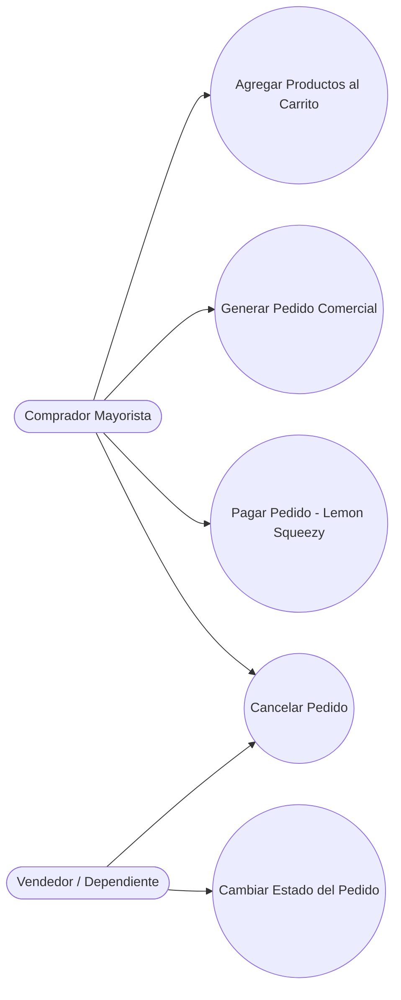

## Descripción del Módulo
<!-- [SECTION_START: Descripción del Módulo] -->
Actúa como el motor transaccional del sistema, materializando la intención de compra del cliente en órdenes comerciales estructuradas. Separa claramente la experiencia de compra de la gestión operativa: mientras el Comprador Mayorista se encarga de la consolidación de su carrito, validación de totales y pago en línea, el Vendedor interviene en la etapa posterior para gestionar manualmente el avance físico logístico. Esto incluye un flujo seguro de validación continua (stock y auth) antes de la generación del pedido, y la orquestación automatizada del pago mediante webhooks verificados criptográficamente (Lemon Squeezy) con reglas de idempotencia.
<!-- [SECTION_END: Descripción del Módulo] -->

## Diagrama (Mermaid)
<!-- [SECTION_START: Diagrama (Mermaid)] -->

<!-- [SECTION_END: Diagrama (Mermaid)] -->
