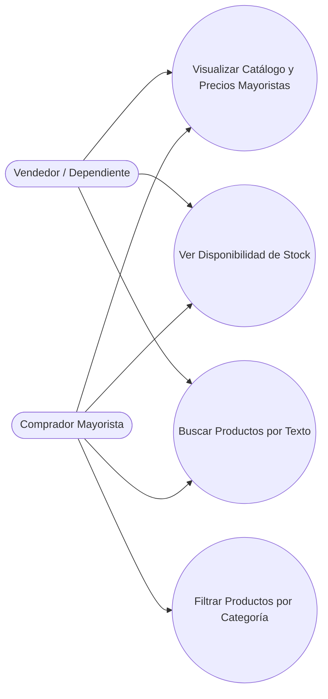

## Descripción del Módulo
<!-- [SECTION_START: Descripción del Módulo] -->
Actúa como la vitrina principal y el punto de entrada transaccional del negocio, permitiendo la exposición remota del inventario a clientes externos. Mientras el Vendedor lo utiliza operativamente como una herramienta de consulta rápida de disponibilidad durante la atención en el mostrador físico, el Comprador Mayorista lo emplea para la exploración autónoma del catálogo. Incluye navegación dinámica mediante filtros de categorías comerciales y búsquedas de texto en tiempo real. Un aspecto crítico es el cálculo automatizado de las condiciones comerciales y etiquetas precisas de stock ("Disponible", "Pocas unidades", "Agotado").
<!-- [SECTION_END: Descripción del Módulo] -->

## Diagrama (Mermaid)
<!-- [SECTION_START: Diagrama (Mermaid)] -->

<!-- [SECTION_END: Diagrama (Mermaid)] -->
