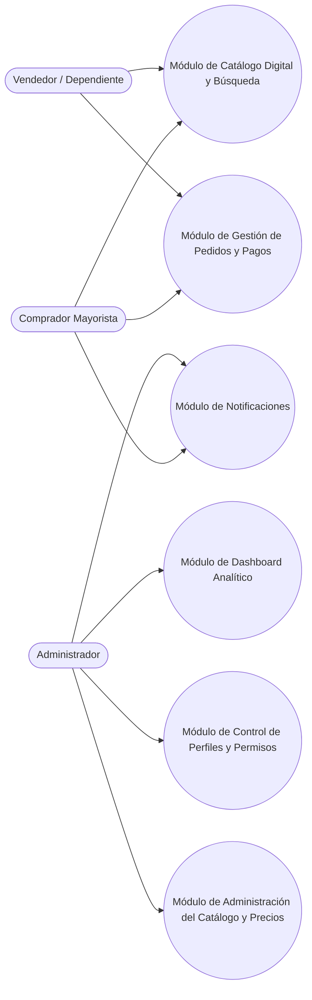

## Descripción del Módulo
<!-- [SECTION_START: Descripción del Módulo] -->
Módulo Maestro que orquesta todo el Canal Digital de Ventas de la Papelería Costa Azul.
<!-- [SECTION_END: Descripción del Módulo] -->

## Diagrama (Mermaid)
<!-- [SECTION_START: Diagrama (Mermaid)] -->

<!-- [SECTION_END: Diagrama (Mermaid)] -->
