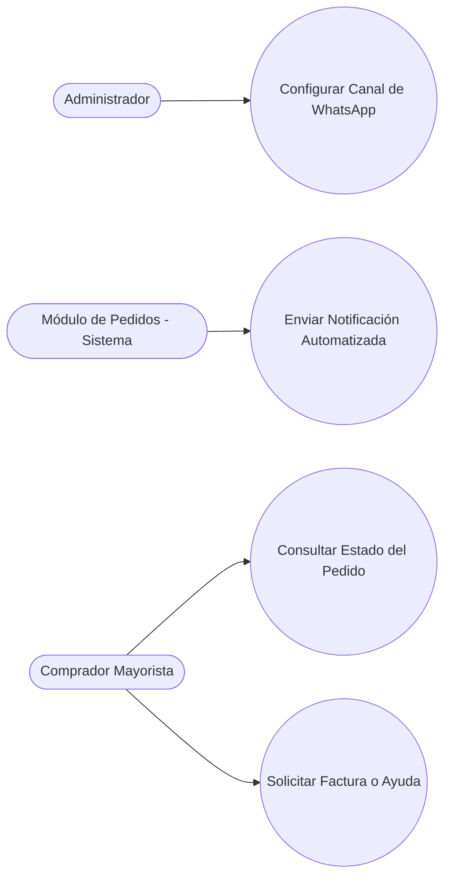

## Descripción del Módulo
<!-- [SECTION_START: Descripción del Módulo] -->
El Módulo de Notificaciones actúa como el canal oficial de comunicación directa entre la papelería y sus clientes mayoristas, reduciendo la incertidumbre de la compra en línea. Este módulo separa claramente la configuración técnica de la operación: mientras el Administrador define la estructura base al enlazar de forma segura las credenciales de la API de WhatsApp Cloud, el Comprador Mayorista utiliza su interfaz de chat para interactuar con el sistema. Un aspecto crítico es la gestión del flujo de estados del pedido comercial (Pendiente, Confirmado, Enviado, Entregado y Cancelado) mediante notificaciones asíncronas.
<!-- [SECTION_END: Descripción del Módulo] -->

## Diagrama (Mermaid)
<!-- [SECTION_START: Diagrama (Mermaid)] -->

<!-- [SECTION_END: Diagrama (Mermaid)] -->
